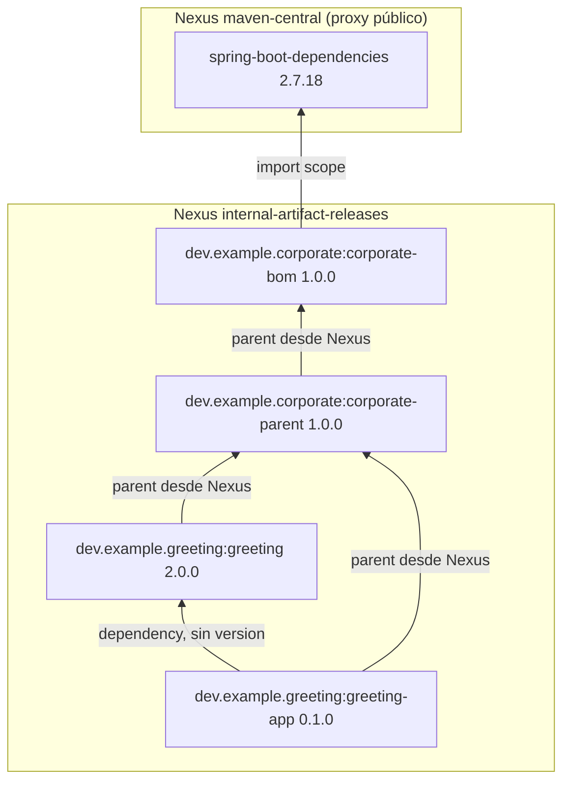
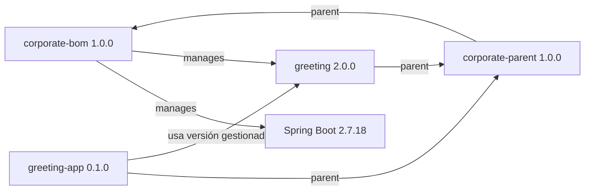
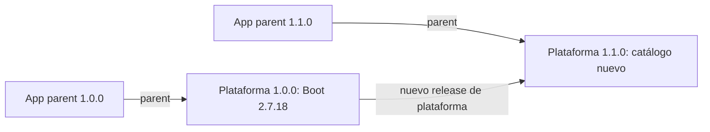
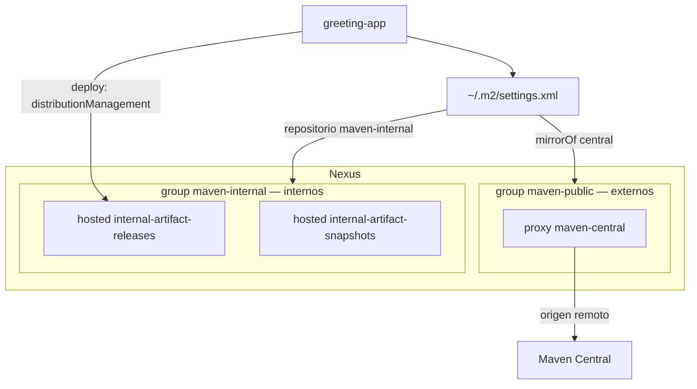

# Parent y BOM corporativos con Spring Boot 2.7

Ejemplo de plataforma Maven de empresa: **Spring Boot 2.7.18** y **Java 8**.
Dos artefactos distintos:

- `corporate-bom` es el catálogo de versiones (`spring-boot-dependencies` en
  Spring Boot).
- `corporate-parent` es la política de build sobre ese catálogo
  (`spring-boot-starter-parent` en Spring Boot).

Cadena de **parent**:

`greeting-app` / `greeting` → `corporate-parent` → `corporate-bom`

Es el mismo esquema que Spring Boot:

aplicación → `spring-boot-starter-parent` → `spring-boot-dependencies`

Cada POM tiene un solo parent. `greeting` y `greeting-app` declaran
`corporate-parent`. Ese POM declara `corporate-bom` (solo catálogo de
versiones) y le añade compiler, enforcer y plugins. Dos saltos, como Spring
Boot: la app no declara el catálogo; declara el parent de política, y ese
declara el catálogo. `spring-boot-starter-parent` tampoco está fundido con
`spring-boot-dependencies`.

Este git tiene **cuatro proyectos Maven independientes**:

1. `corporate-bom`
2. `corporate-parent`
3. `greeting`
4. `greeting-app`

BOM y parent se publican como **1.0.0**. `corporate-parent`, `greeting` y
`greeting-app` dejan `<relativePath/>` vacío: Maven pide el parent a Nexus,
no a `../pom.xml`. El BOM hay que publicarlo antes que el parent (si no, el
build de `corporate-parent` no encuentra `corporate-bom`). Luego, el mismo
orden para greeting: parent ya en Nexus.

## Settings de usuario: dónde se leen los artefactos

El `settings.xml` de cada desarrollador separa **externos** e **internos**.
No hay un group que mezcle ambos.

- **Externos:** `mirrorOf` de `central` hacia el group `maven-public`
  (Compose, puerto 8081). Ese group solo tiene el proxy `maven-central`.
  Lo que Maven pediría a Maven Central va ahí.
- **Internos:** un profile activo con el group `maven-internal` (los dos
  hosted de empresa). El parent con `<relativePath/>` vacío y las
  librerías `dev.example.*` salen de esa URL, no de `maven-public`.

El deploy **no** usa ningún group: usa las URL de `<distributionManagement>`
(hosted `internal-artifact-releases`). Un group de Nexus no admite
`mvn deploy`.

El password no va escrito en git: en el settings está `${env.NEXUS_PASSWORD}`.
El usuario del `<server>` es `admin` (fijo en el fichero de la demo).

## Corporate-bom: catálogo de versiones y dónde se publica (`distributionManagement`)

La publicación se declara en `<distributionManagement>` del POM de
`corporate-bom`; `corporate-parent`, `greeting` y `greeting-app` lo heredan.

El `<id>` (`nexus-internal-releases`) coincide con un `<server>` del
settings (usuario `admin`, password interpolado). Las URL son
`${env.NEXUS_INTERNAL_RELEASES_URL}` y la de snapshots; Maven las interpola
al hacer deploy. El POM que queda en Nexus lleva ya la URL concreta, no la
variable.

## Demostración

Codespace, reconstruir el contenedor (Maven 3.9.9 y Docker-in-Docker) y:

```bash
./demo.sh
```

El settings de usuario por defecto es `~/.m2/settings.xml`.
El repo guarda `settings/nexus-settings.xml`. `./demo.sh` lo copia ahí para que 
`mvn` pueda usar Nexus para consumir artefactos.

Después arranca Nexus y hace deploy, en este orden, a
`internal-artifact-releases`: `corporate-bom`, `corporate-parent`,
`greeting`. Entre un deploy y el siguiente borra
`~/.m2/repository/dev/example` para que el parent y el BOM no salgan del
disco. Luego los tests de `greeting-app` (parent, BOM y librería por
`maven-internal`; Spring Boot por `maven-public` → proxy `maven-central`).
Al final, deploy de `greeting-app` con `-DskipTests`.

`greeting` y `greeting-app` declaran `groupId` `dev.example.greeting`. Si no,
heredarían `dev.example.corporate` del parent.

## Estructura elegida



## Versionado

Versión de plataforma, versiones gestionadas y versión de producto son
independientes.



- **Plataforma:** BOM y parent salen con la misma versión. La aplicación
  elige plataforma cambiando la versión del parent.
- **Gestionadas:** el BOM fija Spring Boot y librerías internas aprobadas. No
  tienen que coincidir con la versión de plataforma.
- **Producto:** cada librería y aplicación declara su versión. Si no, heredaría
  la de la plataforma y se publicaría como si fuera la plataforma.

Cambiar la línea de Spring Boot exige un release nuevo de plataforma. Las
apps ya publicadas no se actualizan solas:



`spring-boot.version` está en `corporate-bom`. `corporate-parent` lo hereda
para pluginManagement porque el BOM es su parent, no un import.

## Repositorios

Nexus OSS trae de serie el group `maven-public` (con hosted vacíos de
ejemplo más el proxy `maven-central`). Esta demo deja `maven-public` **solo**
con `maven-central`: es el group de **externos**. Añade dos hosted de
empresa y el group `maven-internal` con esos miembros, en este orden:
`internal-artifact-releases`, `internal-artifact-snapshots`. Eso es el
group de **internos**.

Los groups son URL de lectura. El proxy `maven-central` es quien habla con
Maven Central en internet. El deploy escribe en el hosted
(`distributionManagement`), no en `maven-internal`.



## Fuentes

- [Spring Boot Maven plugin: using Boot without its parent](https://docs.spring.io/spring-boot/docs/2.7.18/maven-plugin/reference/htmlsingle/#using-boot)
- [Maven settings reference](https://maven.apache.org/settings.html)
- [Maven mirror guide](https://maven.apache.org/guides/mini/guide-mirror-settings)
- [Sonatype: why repositories in POMs are problematic](https://www.sonatype.com/blog/2009/02/why-putting-repositories-in-your-poms-is-a-bad-idea)
- [Nexus Repository REST: repositories](https://help.sonatype.com/en/repositories-api.html)
- [JLBP-15: publish a BOM for multi-module projects](http://jlbp.dev/JLBP-15)
