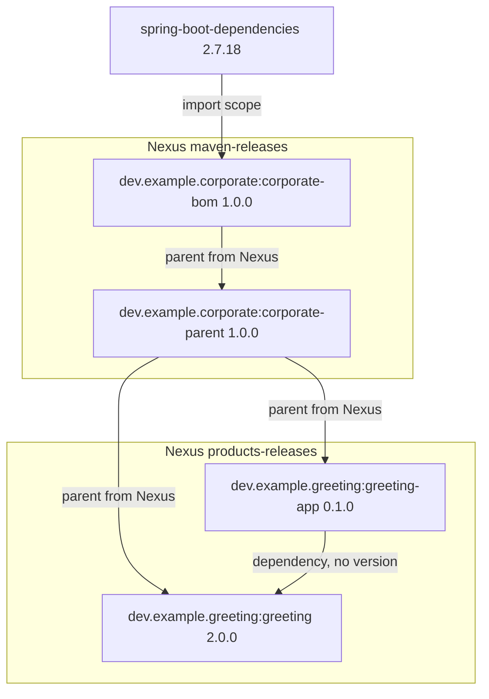
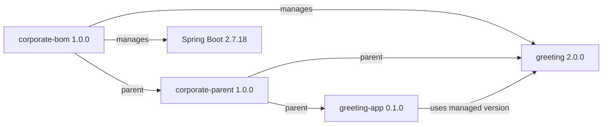
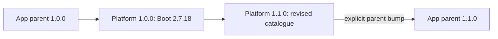
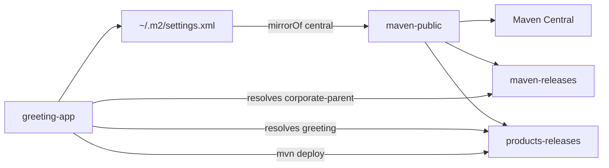
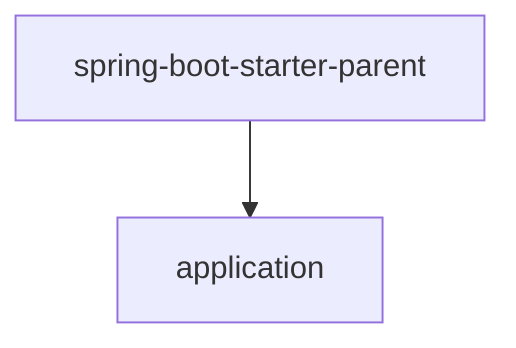
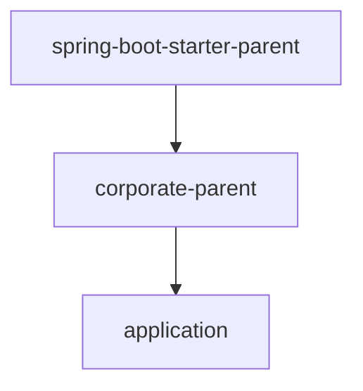
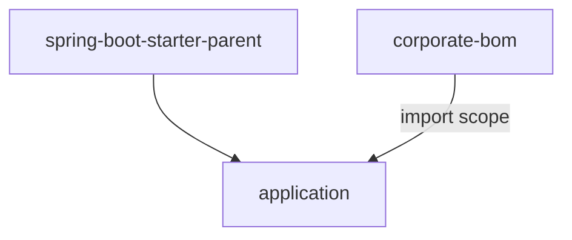
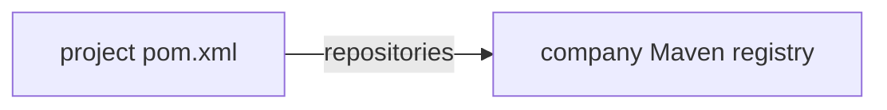
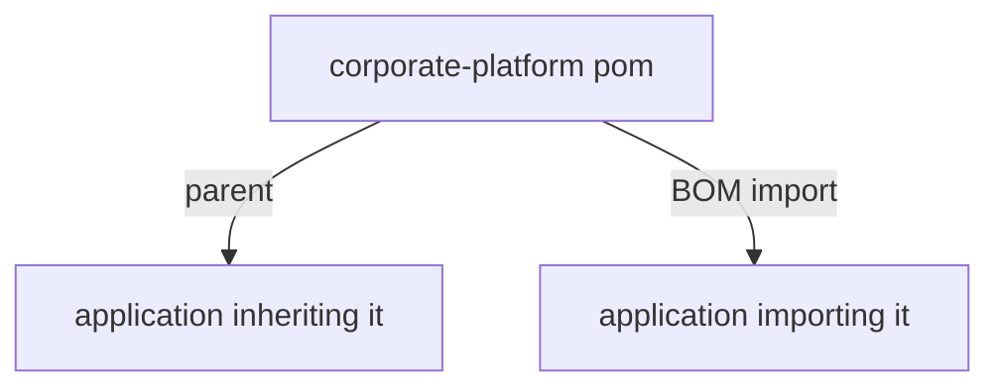

# Corporate parent and BOM with Spring Boot 2.7

Runnable example of a company Maven platform for **Spring Boot 2.7.18** and
**Java 8**. It separates two jobs:

- `corporate-bom` is the version catalogue (`spring-boot-dependencies` in
  Spring Boot).
- `corporate-parent` is build policy on top of that catalogue
  (`spring-boot-starter-parent` in Spring Boot).

This git repository holds **four independent Maven projects**, not a reactor:

1. `corporate-bom`
2. `corporate-parent`
3. `greeting`
4. `greeting-app`

There is no root `pom.xml`. Both platform artifacts are version **1.0.0**.
Deploy the BOM first, then the parent, so `corporate-parent` can resolve
`corporate-bom` from Nexus the same way `spring-boot-starter-parent` resolves
`spring-boot-dependencies`.

Nexus OSS in Compose is the only registry. Platform artifacts deploy to
`maven-releases`. Product artifacts deploy to a separate hosted repository,
`products-releases`. Consumers resolve both through the `maven-public` group,
which also proxies Maven Central.

Coordinates follow the same split. Platform artifacts use groupId
`dev.example.corporate`. Greeting library and application use
`dev.example.greeting`. A child inherits its parent's groupId unless it
declares its own, so the greeting projects set `<groupId>` explicitly.

## Independent Maven projects

Each directory is its own Maven build. Maven’s default parent lookup is
**not** the repository: it is the file `../pom.xml`. `<relativePath/>` with
no value disables that checkout search, so Maven uses the local cache and
then Nexus (`maven-public`), the same way an app finds
`spring-boot-starter-parent` on Central. A non-empty
`<relativePath>../corporate-parent/pom.xml</relativePath>` would read the
sibling on disk and skip the registry.

`settings/nexus-settings.xml` in this repo is the template. Maven’s default
user settings file is `~/.m2/settings.xml`. `scripts/install-maven-settings.sh`
copies the template there (Codespace `postCreateCommand` and `demo.sh` both
run it). After that, a plain `mvn` command uses Nexus; no `.mvn/maven.config`
and no `--settings` flag.

## Run it

Open this repository in a Codespace. Rebuild the container so Maven 3.9.9 and
Docker-in-Docker are installed, then:

```bash
./scripts/demo.sh
```

That starts Nexus, publishes `corporate-bom` then `corporate-parent` to
`maven-releases`, publishes `greeting` to `products-releases`, then runs the
application tests after clearing `~/.m2` so the parent, BOM, and library are
fetched from Nexus.

The test starts the Spring Boot application context and checks:

```text
Hello, Codespaces
```

Inspect the effective model of the application project:

```bash
mvn -f greeting-app/pom.xml help:effective-pom \
  -Doutput=target/effective-pom.xml
```

`~/.m2/settings.xml` already mirrors Central to Nexus. Set `NEXUS_PASSWORD`
if you are not in the Codespace (the dev container exports it). There is
nothing to build at the repository root.

## Confirm that the corporate BOM is used

The application deliberately omits `<version>` from both
`spring-boot-starter` and `greeting`. Maven would reject its model if the
parent chain did not include `corporate-bom`.

Show the versions Maven actually resolved:

```bash
mvn -f greeting-app/pom.xml dependency:tree \
  -Dincludes=dev.example.greeting:greeting,org.springframework.boot:spring-boot-starter
```

The relevant result is:

```text
org.springframework.boot:spring-boot-starter:jar:2.7.18:compile
dev.example.greeting:greeting:jar:2.0.0:compile
```

`greeting-app/target/effective-pom.xml` contains those versions even though
`greeting-app/pom.xml` does not. Greeting apps inherit `corporate-parent`;
that parent inherits `corporate-bom`, as `spring-boot-starter-parent`
inherits `spring-boot-dependencies`. Compiler and plugin configuration come
from `corporate-parent`, not from the BOM.

## The chosen structure



The BOM manages `greeting` and **imports** `spring-boot-dependencies` 2.7.18
(`scope` import). That is the Spring Boot catalogue pattern.

`corporate-parent` does **not** import the corporate BOM. It uses it as
`<parent>`, which is where `spring-boot-starter-parent` sits relative to
`spring-boot-dependencies`. The parent then adds what a BOM does not:

- Java 8 compiler settings and UTF-8.
- Pinned compiler, test, enforcer, and Spring Boot Maven plugins.
- Enforced Maven 3.6+ and Java 8+.
- Organisation, licence, and SCM metadata.

Deployment URLs for the platform are on `corporate-bom` and inherited.

The parent does **not** extend `spring-boot-starter-parent`. Maven permits
one parent. That slot is `corporate-bom`, then `corporate-parent` for
applications. Boot versions still arrive because the BOM imports
`spring-boot-dependencies`.

`java.version` is a convention of the Spring Boot parent. It has no effect
here. The corporate parent therefore sets `maven.compiler.source` and
`maven.compiler.target` to `1.8`.

## Versioning

Platform, managed dependency, and product versions are independent.



- **Platform version:** BOM and parent are released with the same version.
  Applications select a platform by changing their parent version.
- **Managed versions:** the BOM pins Spring Boot and approved internal
  libraries. They do not have to match the platform version.
- **Product versions:** every library and application declares its own
  version. Otherwise it would inherit the platform version and be published
  as though it were the platform.

Changing the Spring Boot line requires a new platform release. Existing
applications do not float to it:



`spring-boot.version` lives on `corporate-bom`. `corporate-parent` inherits it
for plugin management because the BOM is its parent, not an import.

## Repository roles

One Nexus instance, two hosted Maven repositories, one group for consumption.



The checked-in template `settings/nexus-settings.xml` is copied to
`~/.m2/settings.xml`. That file mirrors Maven Central to `maven-public`,
which already includes the hosted platform and product repositories. Deploy
credentials are `NEXUS_PASSWORD`. URLs in `distributionManagement` are
environment variables, not frozen hostnames inside released POMs.

The default `maven-releases` / `maven-snapshots` pair holds the platform.
`scripts/provision-nexus.sh` creates `products-releases` /
`products-snapshots` and adds them to `maven-public`. Redeploy of the same
release version is allowed so `./scripts/demo.sh` can be repeated.

## Alternatives

### Spring Boot is the only parent



This is smallest for an independent service. Java defaults, dependency
management, and Boot plugin defaults arrive together. Company enforcer rules,
deployment settings, and metadata must be repeated or omitted.

### Corporate parent extends the Spring Boot parent



This provides company rules and all Boot parent defaults through one chain.
It is valid and often convenient, but couples each corporate-parent release
line to one Boot line. The chosen design uses Spring's chain
(catalogue POM, then policy POM, then the app) with `corporate-bom` in
the `spring-boot-dependencies` slot, not `spring-boot-starter-parent`.

### Corporate BOM only



Use this when an application cannot change its parent. Internal versions stay
aligned, but company compiler rules, enforcer rules, metadata, and deployment
settings are not inherited.

### Repository URLs in the POM



A checkout can then resolve artifacts without company `settings.xml`. The URL
is frozen into every released POM, and a `mirrorOf *` setting would redirect
it. The chosen design treats registry locations as environment configuration.

### One POM used as parent and BOM



This publishes fewer artifacts, but the two consumers receive different
things. Parent inheritance includes build policy; import includes only
`dependencyManagement`. Separate artifacts make that boundary explicit and
keep the catalogue usable without inheriting company build behavior.

## Sources

- [Spring Boot Maven plugin: using Boot without its parent](https://docs.spring.io/spring-boot/docs/2.7.18/maven-plugin/reference/htmlsingle/#using-boot)
- [Maven settings reference](https://maven.apache.org/settings.html)
- [Maven mirror guide](https://maven.apache.org/guides/mini/guide-mirror-settings)
- [Sonatype: why repositories in POMs are problematic](https://www.sonatype.com/blog/2009/02/why-putting-repositories-in-your-poms-is-a-bad-idea)
- [Nexus Repository REST: repositories](https://help.sonatype.com/en/repositories-api.html)
- [JLBP-15: publish a BOM for multi-module projects](http://jlbp.dev/JLBP-15)
