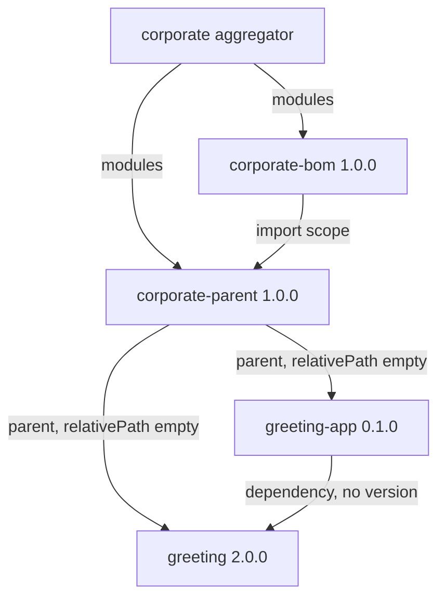
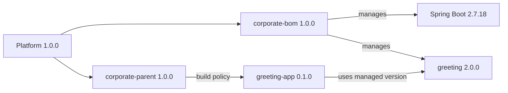
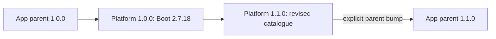
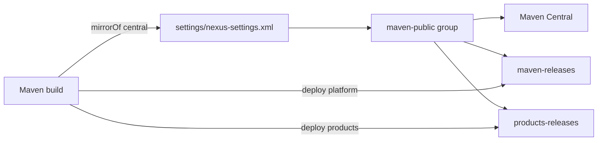
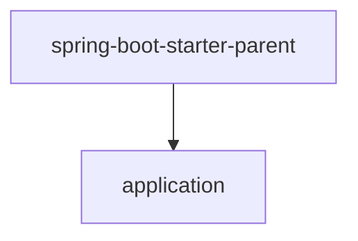
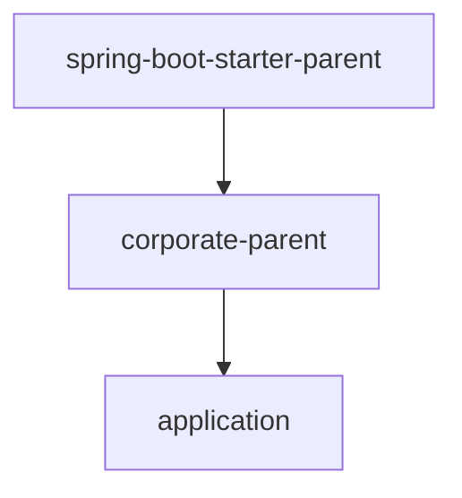
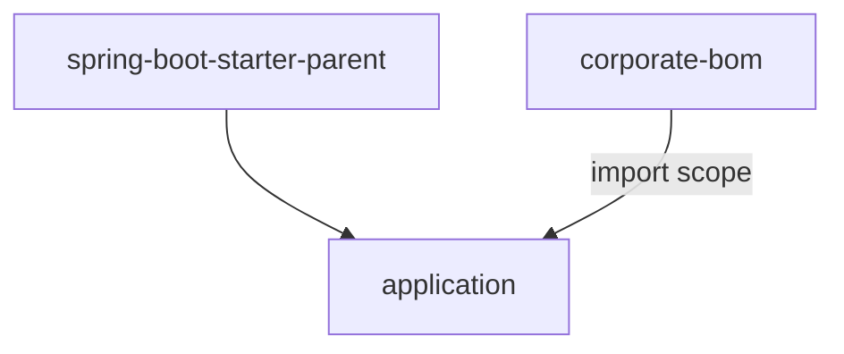
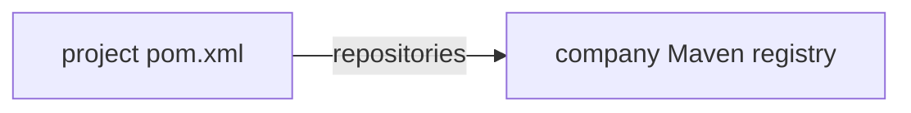
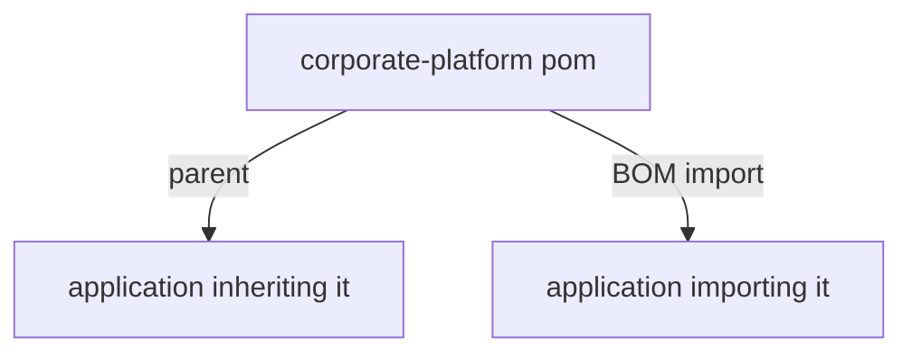

# Corporate parent and BOM with Spring Boot 2.7

Runnable example of a company Maven platform for **Spring Boot 2.7.18** and
**Java 8**. It separates two jobs:

- `corporate-bom` is an importable dependency catalogue.
- `corporate-parent` is inherited build policy.

This git repository holds **three Maven projects**, not one reactor:

1. Corporate platform (`pom.xml` plus `corporate-bom` and `corporate-parent`).
2. `greeting`.
3. `greeting-app`.

Nexus OSS in Compose is the only registry. Platform artifacts deploy to
`maven-releases`. Product artifacts deploy to a separate hosted repository,
`products-releases`. Consumers resolve both through the `maven-public` group,
which also proxies Maven Central.

## Maven modules

`<modules>` still makes sense **inside the corporate project**. The BOM and
parent are two artifacts of one lockstep platform. An aggregator is how Maven
builds and deploys them together without making either one the parent of the
other.

`<modules>` does **not** belong at the repository root spanning greeting or
greeting-app. Those are independent Maven projects. If they were reactor
modules, Maven would resolve `corporate-parent` from the filesystem and the
Nexus story would be fake. Empty `<relativePath/>` is what forces the parent
to come from Nexus.

## Run it

Open this repository in a Codespace. Rebuild the container so Maven 3.9.9 and
Docker-in-Docker are installed, then:

```bash
./scripts/demo.sh
```

That starts Nexus, publishes the platform to `maven-releases`, publishes
`greeting` to `products-releases`, then runs the application tests after
clearing `~/.m2` so both the parent and the library are fetched from Nexus.

The test starts the Spring Boot application context and checks:

```text
Hello, Codespaces
```

Inspect the effective model of the application project:

```bash
export NEXUS_PASSWORD=admin123
export NEXUS_PRODUCTS_RELEASES_URL=http://127.0.0.1:8081/repository/products-releases/
export NEXUS_PRODUCTS_SNAPSHOTS_URL=http://127.0.0.1:8081/repository/products-snapshots/
mvn -f greeting-app/pom.xml --settings settings/nexus-settings.xml \
  help:effective-pom -Doutput=target/effective-pom.xml
```

`mvn test` at the repository root only builds the corporate aggregator. It
does not build greeting or greeting-app.

## Confirm that the corporate BOM is used

The application deliberately omits `<version>` from both
`spring-boot-starter` and `greeting`. Maven would reject its model if the
corporate parent did not import `corporate-bom`.

Show the versions Maven actually resolved:

```bash
export NEXUS_PASSWORD=admin123
mvn -f greeting-app/pom.xml --settings settings/nexus-settings.xml \
  dependency:tree \
  -Dincludes=dev.example:greeting,org.springframework.boot:spring-boot-starter
```

The relevant result is:

```text
org.springframework.boot:spring-boot-starter:jar:2.7.18:compile
dev.example:greeting:jar:2.0.0:compile
```

`greeting-app/target/effective-pom.xml` contains those versions even though
`greeting-app/pom.xml` does not. That is the observable effect of the BOM
import. Parent-only effects are different: compiler and plugin configuration
appear because `corporate-parent` is inherited, not because its BOM is
imported.

## The chosen structure



The BOM manages `greeting` and imports `spring-boot-dependencies` 2.7.18.
The parent imports that BOM and supplies what an imported BOM cannot:

- Java 8 compiler settings and UTF-8.
- Pinned compiler, test, enforcer, and Spring Boot Maven plugins.
- Enforced Maven 3.6+ and Java 8+.
- Nexus `distributionManagement` for the platform repositories.
- Organisation, licence, and SCM metadata.

The parent does **not** extend `spring-boot-starter-parent`. Maven permits one
parent, and that slot is the company policy. Importing
`spring-boot-dependencies` retains Spring Boot's dependency alignment, but not
its plugin management.

`java.version` is a convention of the Spring Boot parent. It has no effect
here. The corporate parent therefore sets `maven.compiler.source` and
`maven.compiler.target` to `1.8`.

## Versioning

Platform, managed dependency, and product versions are independent.



- **Platform version:** the BOM and parent are released together with the same
  version. Applications select a platform by changing their parent version.
- **Managed versions:** the BOM pins Spring Boot and approved internal
  libraries. They do not have to match the platform version.
- **Product versions:** every library and application declares its own
  version. Otherwise it would inherit the platform version and be published
  as though it were the platform.

Changing the Spring Boot line requires a new platform release. Existing
applications do not float to it:



A BOM import does not expose its properties to the importing POM, so
`spring-boot.version` appears in the BOM for its dependency import and in the
parent for plugin management.

## Repository roles

One Nexus instance, two hosted Maven repositories, one group for consumption.



`settings/nexus-settings.xml` mirrors Maven Central to `maven-public`, which
already includes the hosted platform and product repositories. Deploy
credentials are `NEXUS_PASSWORD`. URLs in `distributionManagement` are
environment variables, not frozen hostnames inside released POMs.

The default `maven-releases` / `maven-snapshots` pair holds the platform.
`scripts/provision-nexus.sh` creates `products-releases` /
`products-snapshots` and adds them to `maven-public`. Redeploy of the same
release version is allowed so `./scripts/demo.sh` can be repeated.

## Alternatives

### Spring Boot is the only parent



This is smallest for an independent service. Java defaults, dependency
management, and Boot plugin defaults arrive together. Company enforcer rules,
deployment settings, and metadata must be repeated or omitted.

### Corporate parent extends the Spring Boot parent



This provides company rules and all Boot parent defaults through one chain.
It is valid and often convenient, but couples each corporate-parent release
line to one Boot line. The chosen design makes the imported dependency
catalogue and explicit plugin policy visible instead.

### Corporate BOM only



Use this when an application cannot change its parent. Internal versions stay
aligned, but company compiler rules, enforcer rules, metadata, and deployment
settings are not inherited.

### Repository URLs in the POM



A checkout can then resolve artifacts without company `settings.xml`. The URL
is frozen into every released POM, and a `mirrorOf *` setting would redirect
it. The chosen design treats registry locations as environment configuration.

### One POM used as parent and BOM



This publishes fewer artifacts, but the two consumers receive different
things. Parent inheritance includes build policy; import includes only
`dependencyManagement`. Separate artifacts make that boundary explicit and
keep the catalogue usable without inheriting company build behavior.

## Sources

- [Spring Boot Maven plugin: using Boot without its parent](https://docs.spring.io/spring-boot/docs/2.7.18/maven-plugin/reference/htmlsingle/#using-boot)
- [Maven settings reference](https://maven.apache.org/settings.html)
- [Maven mirror guide](https://maven.apache.org/guides/mini/guide-mirror-settings)
- [Sonatype: why repositories in POMs are problematic](https://www.sonatype.com/blog/2009/02/why-putting-repositories-in-your-poms-is-a-bad-idea)
- [Nexus Repository REST: repositories](https://help.sonatype.com/en/repositories-api.html)
- [JLBP-15: publish a BOM for multi-module projects](http://jlbp.dev/JLBP-15)
