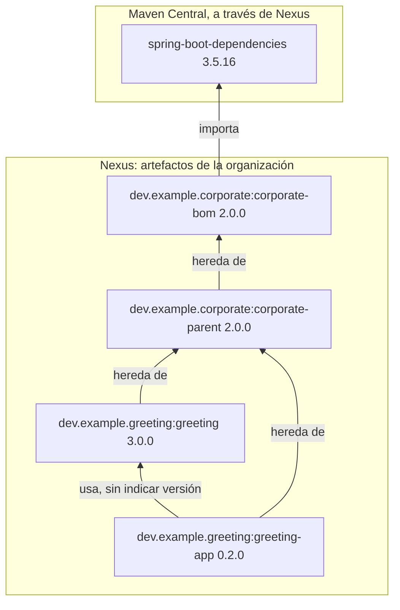
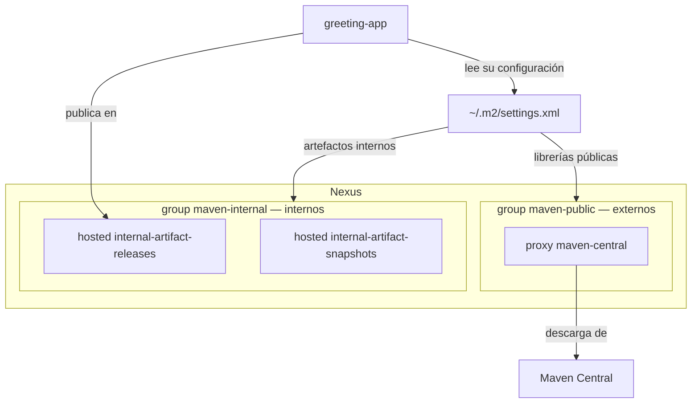
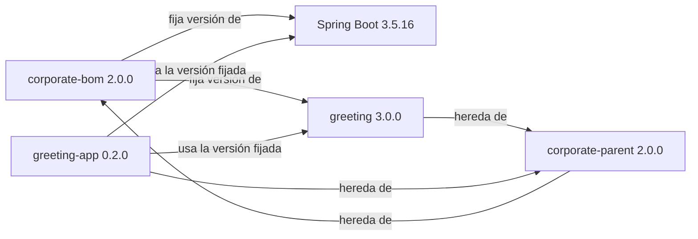
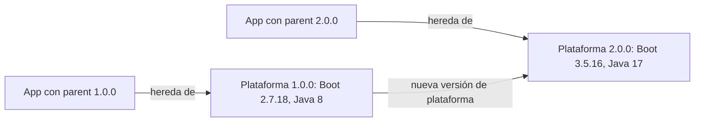

# Parent y BOM corporativos con Spring Boot 3.5

[](https://github.com/IAAA-Lab/maven-corporate-pom-springboot2/actions/workflows/ci.yml)

## Qué problema resuelve

En una organización con muchos proyectos Java, cada equipo tiende a elegir sus
propias versiones de librerías y su propia forma de compilar. Con el tiempo,
cada proyecto es distinto, y un cambio común (por ejemplo, pasar a una versión
nueva de Spring Boot) obliga a tocarlos uno a uno.

Este repositorio muestra una solución habitual con **Maven**, la herramienta
que compila y empaqueta los proyectos Java: una **plataforma corporativa** que
fija en un solo sitio las versiones y las reglas de build, y que todos los
proyectos reutilizan. El ejemplo usa **Java 17** y **Spring Boot 3.5.16**.

La plataforma anterior, con Java 8 y Spring Boot 2.7, sigue disponible en la
etiqueta [`springboot-2.7`](https://github.com/IAAA-Lab/maven-corporate-pom-springboot2/tree/springboot-2.7).
Los commits que llevan de una a otra se explican en
[Cómo evoluciona la plataforma](#cómo-evoluciona-la-plataforma).

## Conceptos

- **POM** (`pom.xml`): el fichero que describe un proyecto Maven: su versión,
  las librerías de las que depende y cómo se compila.
- **Artefacto**: lo que publica un proyecto (una librería, una aplicación o un
  POM) para que otros lo usen. Se identifica por `groupId:artifactId:versión`,
  por ejemplo `dev.example.greeting:greeting:3.0.0`.
- **BOM** (*bill of materials*): un POM que solo contiene una lista de
  librerías con su versión. Quien lo usa pide una librería sin indicar la
  versión y recibe la del catálogo.
- **Parent**: un POM del que otros heredan. El proyecto hijo recibe su
  configuración sin tener que repetirla.
- **Nexus**: el servidor de artefactos de la organización. Guarda lo que se
  publica internamente y hace de intermediario con **Maven Central**, el
  repositorio público de librerías Java.

Spring Boot se organiza así: `spring-boot-dependencies` es su BOM y
`spring-boot-starter-parent` es su parent. La plataforma de este ejemplo copia
esa estructura.

## Qué contiene el repositorio

Tres proyectos Maven:

1. `corporate`: la plataforma. Reúne dos artefactos:
   - `corporate-bom`: el catálogo de versiones. Fija la versión de Spring Boot
     (y con ella la de todas las librerías que Spring Boot gestiona) y la de
     las librerías internas aprobadas, como `greeting` 3.0.0.
   - `corporate-parent`: las reglas de build comunes: Java 17, codificación
     UTF-8, versiones de los plugins de Maven y una comprobación de que se usa
     al menos Maven 3.6.3 y Java 17.
2. `greeting`: una librería interna.
3. `greeting-app`: una aplicación Spring Boot que usa esa librería.

`greeting` y `greeting-app` representan los proyectos de los equipos; en este
documento se llaman **productos**.

Los productos heredan de `corporate-parent`, y este de `corporate-bom`:

`greeting-app` / `greeting` → `corporate-parent` → `corporate-bom`

Así, con una sola declaración de `<parent>`, un producto recibe las versiones
de sus dependencias y las reglas de build. La versión de Spring Boot está
escrita una sola vez, en `corporate-bom`. Un proyecto que solo quiera el
catálogo, sin las reglas de build, puede importar `corporate-bom` en lugar de
heredar de `corporate-parent`.

El diagrama muestra cómo quedan los cuatro artefactos publicados en Nexus y
cómo se relacionan:



## Demostración

Abre el repositorio en un Codespace (en GitHub: «Code» → «Codespaces» →
«Create codespace on main»). El entorno ya trae Java 25, Maven 3.9.16 y Docker.
En el terminal, ejecuta:

```bash
./demo.sh
```

El script muestra en el terminal siete pasos:

1. Configura Maven para usar el Nexus de la demo: copia
   `settings/nexus-settings.xml` en `~/.m2/settings.xml`, el fichero de
   configuración personal que Maven lee por defecto.
2. Arranca Nexus en un contenedor Docker, en el puerto 8081. El primer
   arranque puede tardar un minuto.
3. Espera a que Nexus esté listo y crea sus repositorios (se explican en la
   sección siguiente).
4. Publica la plataforma: `corporate-bom` y `corporate-parent`.
5. Publica la librería `greeting`.
6. Ejecuta los tests de `greeting-app`, que comprueban que la aplicación
   obtiene de la librería el saludo «Hola, Codespaces».
7. Publica `greeting-app`.

El script lee las versiones de los POM. Si una versión termina en `-SNAPSHOT`,
la publica en `internal-artifact-snapshots`; si no, en
`internal-artifact-releases`.

Antes de los pasos 4, 5 y 6 borra la copia local de los artefactos de la demo
(`~/.m2/repository/dev/example`). Así cada producto obtiene la plataforma de
Nexus, como pasaría en el ordenador de otro desarrollador, y no de lo que se
acaba de compilar.

Codespaces reenvía el puerto 8081. Desde la pestaña «Ports» se abre Nexus en el
navegador (usuario `admin`, password `admin123`) para ver lo publicado.

En cada push, a cualquier rama, y en cada pull request a `main`, GitHub
Actions ejecuta `./demo.sh` con un Nexus nuevo. Si falla algún paso, muestra el
log de Nexus.

## Nexus: de dónde se leen y dónde se publican los artefactos

Nexus usa tres tipos de repositorio:

- **hosted**: guarda lo que publica la organización.
- **proxy**: descarga de un repositorio externo (aquí, Maven Central) y guarda
  una copia.
- **group**: una única dirección de lectura que reúne varios repositorios.

La demo separa claramente lo externo de lo interno, y ningún group mezcla
ambos:

- El group `maven-public` es el de **externos**. Solo contiene el proxy
  `maven-central`; de ahí salen Spring Boot y el resto de librerías públicas.
  Nexus trae este group de serie con otros miembros de ejemplo, y la demo lo
  deja solo con el proxy.
- El group `maven-internal` es el de **internos**. Contiene los dos hosted de
  la organización, en este orden: `internal-artifact-releases` (versiones
  definitivas) e `internal-artifact-snapshots` (versiones en desarrollo). De
  ahí salen la plataforma y las librerías `dev.example.*`.

Cada desarrollador lo configura en su `settings.xml`:

- un `mirrorOf` de `central` envía a `maven-public` todo lo que Maven pediría
  a Maven Central;
- un profile activo añade `maven-internal` para los artefactos internos.

Para publicar (`mvn deploy`) no se usan los groups, porque son solo de
lectura. Cada proyecto publica directamente en el hosted, en la dirección que
indica `<distributionManagement>`.



## Versiones

Hay tres tipos de versión, y cada una cambia por su cuenta:

- **Plataforma** (2.0.0): la de `corporate-bom` y `corporate-parent`, que
  siempre se publican juntos y con la misma versión. Cada producto elige qué
  plataforma usa con la versión de `corporate-parent` que declara.
- **Gestionadas** (Spring Boot 3.5.16, `greeting` 3.0.0): las que fija el
  catálogo. No tienen por qué coincidir con la de la plataforma.
- **Producto** (`greeting-app` 0.2.0): cada librería y cada aplicación declara
  la suya. Si no lo hiciera, heredaría la de la plataforma y parecería parte de
  ella.



## Cómo evoluciona la plataforma

Cada generación de la plataforma tiene una etiqueta en git:

| Etiqueta | Plataforma | Spring Boot | Java | `greeting` | `greeting-app` |
| --- | --- | --- | --- | --- | --- |
| [`springboot-2.7`](https://github.com/IAAA-Lab/maven-corporate-pom-springboot2/tree/springboot-2.7) | 1.0.0 | 2.7.18 | 8 | 2.0.0 | 0.1.0 |
| [`springboot-3.5`](https://github.com/IAAA-Lab/maven-corporate-pom-springboot2/tree/springboot-3.5) | 2.0.0 | 3.5.16 | 17 | 3.0.0 | 0.2.0 |

Los commits entre dos etiquetas son la receta del cambio, un paso por commit:

```bash
git log --reverse --stat springboot-2.7..springboot-3.5
```

1. **Abrir la versión nueva como `-SNAPSHOT`.** La plataforma pasa a
   2.0.0-SNAPSHOT y los productos la siguen. Mientras dura el cambio, todo se
   publica en `internal-artifact-snapshots`.
2. **Cambiar el entorno antes que el código.** El Codespace y la CI pasan a
   Java 17; la plataforma sigue compilando para Java 8.
3. **Subir el mínimo de Maven y los plugins.** Las mismas versiones de plugins
   que gestiona Spring Boot 3.5.16.
4. **Subir la versión de Java** de la plataforma a 17.
5. **Subir Spring Boot** en el BOM: una sola property.
6. **Publicar.** Todo pierde `-SNAPSHOT` en el mismo commit.
7. **Documentar.**

Cada commit pasa la demo completa en la CI, con un Nexus vacío.

Tres reglas explican ese orden:

- **Una versión publicada no cambia.** `greeting` 2.0.0 se compiló para Java 8.
  Compilada para Java 17 es otro artefacto, así que se publica como 3.0.0.
  Mientras no está terminada, es 3.0.0-SNAPSHOT.
- **Se publica todo a la vez.** El BOM 2.0.0 fija `greeting` 3.0.0, y
  `greeting` 3.0.0 hereda del parent 2.0.0: ninguno se puede publicar sin el
  otro.
- **Cada equipo decide cuándo actualiza.** Las aplicaciones ya publicadas
  siguen con el parent 1.0.0, que sigue en Nexus, hasta que su equipo sube la
  versión de `corporate-parent`. Aquí la plataforma y los productos comparten
  repositorio y cambian en el mismo commit; en una organización, cada equipo
  hace ese cambio en su propio repositorio.



Spring Boot 3 usa Jakarta EE: los paquetes `javax.*` pasan a `jakarta.*`. Ese
cambio es del código de cada aplicación, no de la plataforma. `greeting-app`
no usa ninguno, así que en este repositorio no aparece.

## Detalles técnicos

### Una sola versión para la plataforma

`corporate/pom.xml` solo reúne los dos módulos para construirlos juntos.
Ningún proyecto hereda de él y no se publica (`maven.deploy.skip`).

La versión de la plataforma se escribe en un único sitio,
`corporate/.mvn/maven.config`:

```text
-Drevision=2.0.0
-DdeployAtEnd=true
```

El BOM y el parent declaran `${revision}` como versión. Al publicar,
`flatten-maven-plugin` (`resolveCiFriendliesOnly`) sustituye esa variable por
`2.0.0` en el POM que llega a Nexus. Flatten solo se ejecuta en la plataforma
(`inherited` a `false`); los productos no lo heredan.

### Publicación conjunta

`mvn -f corporate/pom.xml deploy` construye primero el BOM y después el
parent. Con `deployAtEnd`, la subida espera a que termine todo el build: si
falla el parent, no queda un BOM suelto en Nexus. No es una transacción; si la
subida se corta a mitad, puede quedar publicado solo uno de los dos.

### Por qué el BOM es el padre del parent

Importar un BOM solo aporta su lista de versiones (`dependencyManagement`).
Heredar de él aporta también sus properties. Por eso `corporate-parent` hereda
de `corporate-bom` en lugar de importarlo: así puede versionar
`spring-boot-maven-plugin` con `${spring-boot.version}`, y la versión de Boot
sigue escrita en un solo sitio.

### Dónde busca Maven el parent

`corporate-parent` toma el BOM de este mismo repositorio
(`<relativePath>../corporate-bom/pom.xml</relativePath>`), porque los dos se
construyen juntos. En cambio, `greeting` y `greeting-app` dejan
`<relativePath/>` vacío para que Maven pida el parent a Nexus, como haría un
proyecto de otro equipo en otro repositorio. Por eso declaran a mano la
versión de `corporate-parent`.

### `groupId` de los productos

`greeting` y `greeting-app` declaran su propio `groupId`,
`dev.example.greeting`. Si no lo hicieran, heredarían `dev.example.corporate`
del parent.

### Datos comunes y datos de cada proyecto

`<distributionManagement>` y `organization` se declaran una sola vez, en
`corporate-bom`, y los heredan todos: todos publican en el mismo Nexus y
pertenecen a la misma organización.

La plataforma **no** declara `<licenses>` ni `<scm>`. Maven no permite controlar
su herencia, así que cada producto diría que tiene la licencia de la
plataforma y que su código está en el repositorio de la plataforma (con el
`artifactId` añadido a la URL). Cada proyecto declara los suyos si los
necesita.

### Credenciales y direcciones de Nexus

El `<id>` de `<distributionManagement>` (`nexus-internal-releases`) coincide
con un `<server>` del `settings.xml`, que aporta usuario y password. El
usuario es `admin`, fijo en el fichero de la demo; el password no está en git:
el settings usa `${env.NEXUS_PASSWORD}`.

Las direcciones de publicación son `${env.NEXUS_INTERNAL_RELEASES_URL}` y su
equivalente de snapshots. Maven las sustituye al hacer deploy, así que el POM
que queda en Nexus lleva la dirección concreta y no la variable.

## Fuentes

- [Spring Boot Maven plugin: using Boot without its parent](https://docs.spring.io/spring-boot/3.5/maven-plugin/using.html)
- [Spring Boot 3.5: system requirements](https://docs.spring.io/spring-boot/3.5/system-requirements.html)
- [Spring Boot 3.0 migration guide](https://github.com/spring-projects/spring-boot/wiki/Spring-Boot-3.0-Migration-Guide)
- [Maven settings reference](https://maven.apache.org/settings.html)
- [Maven mirror guide](https://maven.apache.org/guides/mini/guide-mirror-settings)
- [Sonatype: why repositories in POMs are problematic](https://www.sonatype.com/blog/2009/02/why-putting-repositories-in-your-poms-is-a-bad-idea)
- [Nexus Repository REST: repositories](https://help.sonatype.com/en/repositories-api.html)
- [Maven CI-friendly versions](https://maven.apache.org/maven-ci-friendly.html)
- [JLBP-15: publish a BOM for multi-module projects](http://jlbp.dev/JLBP-15)
