# Corporate parent and BOM with Spring Boot 2.7

Runnable example of a company Maven platform for **Spring Boot 2.7.18** and
**Java 8**. It separates two jobs:

- `corporate-bom` is an importable dependency catalogue.
- `corporate-parent` is inherited build policy.

The repository is a compact teaching reactor. In the target GitLab Free
topology, the corporate POMs share one project while each library and
application has its own project and package registry.

## Run it

```bash
mvn test
```

The test starts the Spring Boot application context and checks:

```text
Hello, Codespaces
```

Install the reactor before running the application module by itself:

```bash
mvn install
mvn -f greeting-app/pom.xml spring-boot:run
```

Inspect everything Maven inherited and imported:

```bash
mvn -pl greeting-app help:effective-pom
```

## Confirm that the corporate BOM is used

The application deliberately omits `<version>` from both
`spring-boot-starter` and `greeting`. Maven would reject its model if the
corporate parent did not import `corporate-bom`.

Show the versions Maven actually resolved:

```bash
mvn -pl greeting-app -am dependency:tree \
  -Dincludes=dev.example:greeting,org.springframework.boot:spring-boot-starter
```

The relevant result is:

```text
org.springframework.boot:spring-boot-starter:jar:2.7.18:compile
dev.example:greeting:jar:2.0.0:compile
```

For the complete model:

```bash
mvn -pl greeting-app help:effective-pom \
  -Doutput=target/effective-pom.xml
```

`greeting-app/target/effective-pom.xml` contains those versions even though
`greeting-app/pom.xml` does not. That is the observable effect of the BOM
import. Parent-only effects are different: compiler and plugin configuration
appear because `corporate-parent` is inherited, not because its BOM is
imported.

## The chosen structure

The root POM only aggregates the four modules. It is deliberately not their
parent.

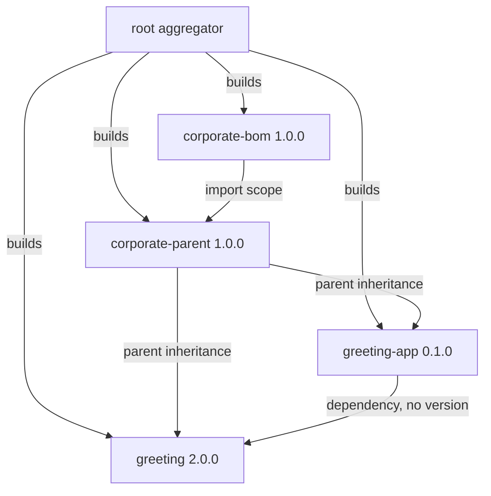

The BOM manages `greeting` and imports `spring-boot-dependencies` 2.7.18.
The parent imports that BOM and supplies what an imported BOM cannot:

- Java 8 compiler settings and UTF-8.
- Pinned compiler, test, enforcer, and Spring Boot Maven plugins.
- Enforced Maven 3.6+ and Java 8+.
- GitLab deployment coordinates.
- Organisation, licence, and SCM metadata.

The parent does **not** extend `spring-boot-starter-parent`. Maven permits one
parent, and that slot is the company policy. Importing
`spring-boot-dependencies` retains Spring Boot's dependency alignment, but not
its plugin management.

`java.version` is a convention of the Spring Boot parent. It has no effect
here. The corporate parent therefore sets `maven.compiler.source` and
`maven.compiler.target` to `1.8`.

## Versioning

Platform, managed dependency, and product versions are independent.

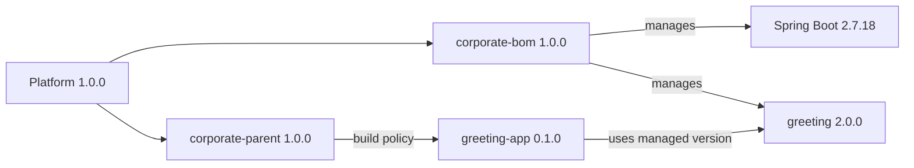

- **Platform version:** the BOM and parent are released together with the same
  version. Applications select a platform by changing their parent version.
- **Managed versions:** the BOM pins Spring Boot and approved internal
  libraries. They do not have to match the platform version.
- **Product versions:** every library and application declares its own
  version. Otherwise it would inherit the platform version and be published
  as though it were the platform.

Changing the Spring Boot line requires a new platform release. Existing
applications do not float to it:

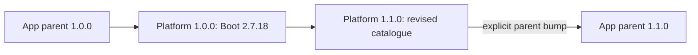

On the default branch a real corporate-POM project carries the next snapshot,
for example `1.1.0-SNAPSHOT`. A protected `v1.1.0` tag publishes immutable
`1.1.0`. A BOM import does not expose its properties to the importing POM, so
`spring-boot.version` appears in the BOM for its dependency import and in the
parent for plugin management.

## Repository roles

Public and internal artifacts use different products.

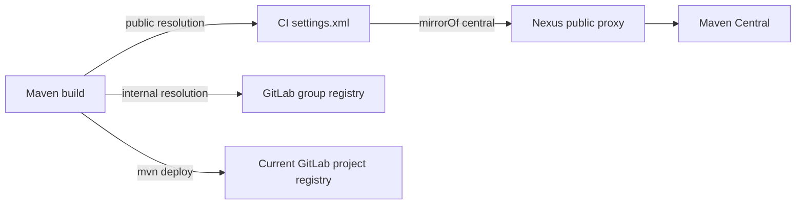

`settings/ci-settings.xml` demonstrates the split:

- Only repository id `central` is mirrored to Nexus. `mirrorOf` is not `*`,
  because that would redirect GitLab package requests to Nexus.
- Internal packages are resolved from the GitLab group endpoint. Every
  `groupId:artifactId` must have one owning project: GitLab group endpoints do
  not guarantee uniqueness and return the newer duplicate.
- Nexus and GitLab credentials are environment variables. No token belongs in
  a POM or in source control.

`distributionManagement` uses the current CI project:

```text
${env.CI_API_V4_URL}/projects/${env.CI_PROJECT_ID}/packages/maven
```

GitLab uses that same project endpoint for `<repository>` and
`<snapshotRepository>`. The version determines whether Maven treats the
artifact as a release or snapshot. Consumers read the group endpoint; CI
publishes to the current project's endpoint.

## Target GitLab topology

The teaching reactor keeps all modules together only so it runs without
company infrastructure. The actual company layout is:

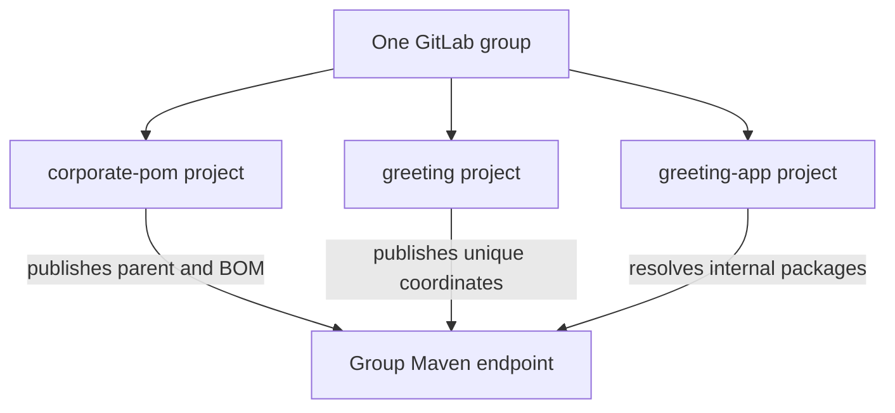

Each source project publishes only to its own project package registry.
Consumers use the group endpoint. The corporate parent and BOM are the
exception to one artifact per source project: they intentionally share one
project and one release.

## CI publication

`gitlab-ci.example.yml` is documentation rather than an active GitHub
workflow. Copy and adapt it in a real GitLab project.

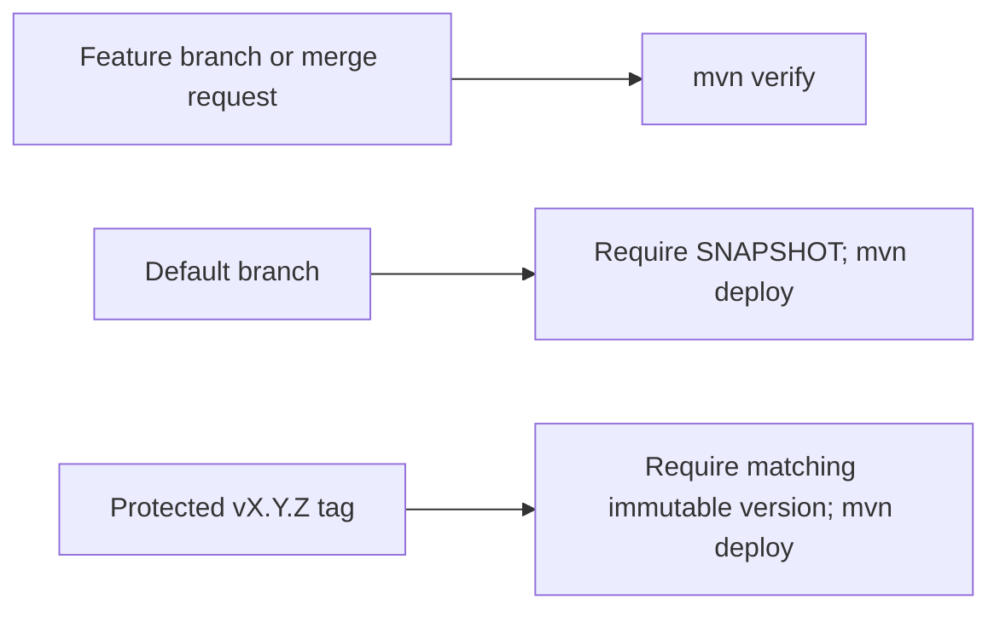

Publishing is CI-only. The GitLab server id uses `gitlab-ci-token` and
`CI_JOB_TOKEN`. The example's checked-in platform and product versions are
releases for clarity; a real default branch changes its project version to the
next snapshot before enabling the deploy job.

### Dry-run the pipeline

GitLab can simulate pipeline creation without running jobs. Copy
`gitlab-ci.example.yml` to `.gitlab-ci.yml` in a disposable GitLab project,
then:

```bash
export CI_API_V4_URL=https://gitlab.example/api/v4
export CI_PROJECT_ID=1
export GITLAB_TOKEN=          # personal access token, never committed
DRY_RUN_REF=feature/demo ./scripts/lint-gitlab-ci.sh
DRY_RUN_REF=main ./scripts/lint-gitlab-ci.sh
DRY_RUN_REF=v1.0.0 ./scripts/lint-gitlab-ci.sh
```

`dry_run: true` asks GitLab to create a pipeline as if that ref had been
pushed, then throw the result away. The JSON `jobs` list is the proof that
the `rules` selected `verify`, `publish-snapshot`, or `publish-release`.
Scripts, Maven, and the package registry are not invoked.

A YAML parse on this machine is not enough: it cannot evaluate `rules`. The
lint API needs a real project because `CI_DEFAULT_BRANCH` and protected tags
come from that project.

To execute the jobs, use that disposable GitLab project:

1. Feature branch or merge request: only `verify` (`mvn verify`).
2. Default branch with a `*-SNAPSHOT` version: `publish-snapshot`.
3. Protected tag `vX.Y.Z` matching the project version: `publish-release`.
4. Repeat the same release tag: GitLab rejects the duplicate immutable
   version.

`gitlab-runner exec` can run one job's `script` locally. It does not apply
`rules`, merge-request variables, or `CI_JOB_TOKEN` package authentication.

## Alternatives

### Spring Boot is the only parent

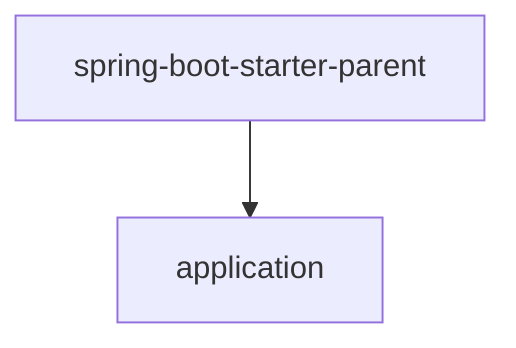

This is smallest for an independent service. Java defaults, dependency
management, and Boot plugin defaults arrive together. Company enforcer rules,
deployment settings, and metadata must be repeated or omitted.

### Corporate parent extends the Spring Boot parent

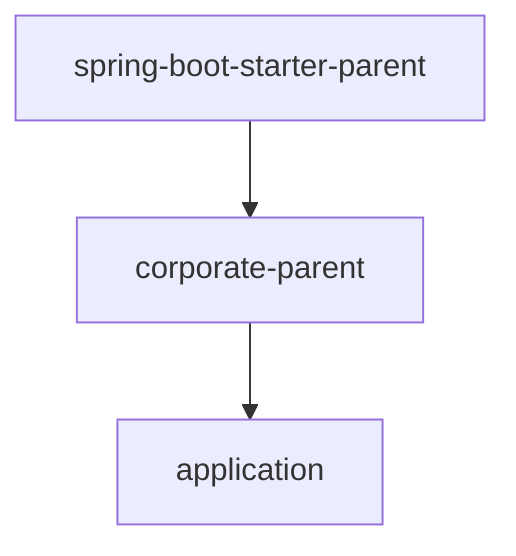

This provides company rules and all Boot parent defaults through one chain.
It is valid and often convenient, but couples each corporate-parent release
line to one Boot line. The chosen design makes the imported dependency
catalogue and explicit plugin policy visible instead.

### Corporate BOM only

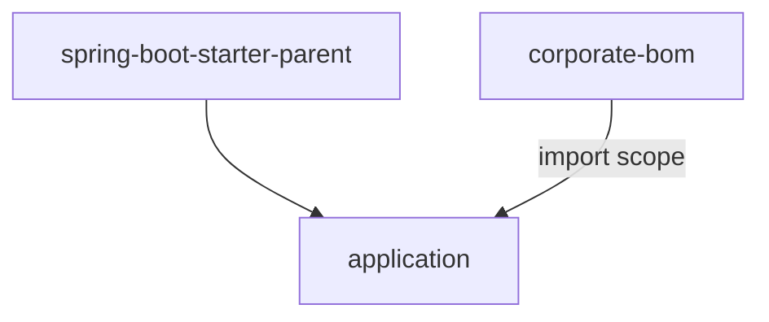

Use this when an application cannot change its parent. Internal versions stay
aligned, but company compiler rules, enforcer rules, metadata, and deployment
settings are not inherited.

### GitLab group endpoint in the POM

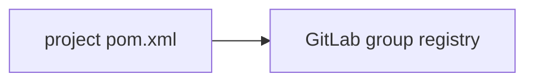

GitLab documents this portable option. A checkout can resolve internal
artifacts without company settings. The URL is then frozen into every
released POM, and a company `mirrorOf *` setting would redirect it. The chosen
design treats repository locations as environment configuration.

### One POM used as parent and BOM

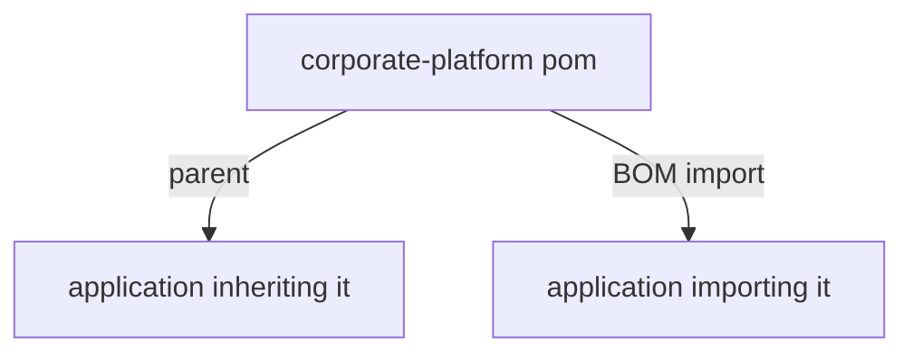

This publishes fewer artifacts, but the two consumers receive different
things. Parent inheritance includes build policy; import includes only
`dependencyManagement`. Separate artifacts make that boundary explicit and
keep the catalogue usable without inheriting company build behavior.

## Sources

- [Spring Boot Maven plugin: using Boot without its parent](https://docs.spring.io/spring-boot/docs/2.7.18/maven-plugin/reference/htmlsingle/#using-boot)
- [Maven settings reference](https://maven.apache.org/settings.html)
- [Maven mirror guide](https://maven.apache.org/guides/mini/guide-mirror-settings)
- [Sonatype: why repositories in POMs are problematic](https://www.sonatype.com/blog/2009/02/why-putting-repositories-in-your-poms-is-a-bad-idea)
- [GitLab Maven package registry](https://docs.gitlab.com/user/packages/maven_repository/)
- [JLBP-15: publish a BOM for multi-module projects](http://jlbp.dev/JLBP-15)
