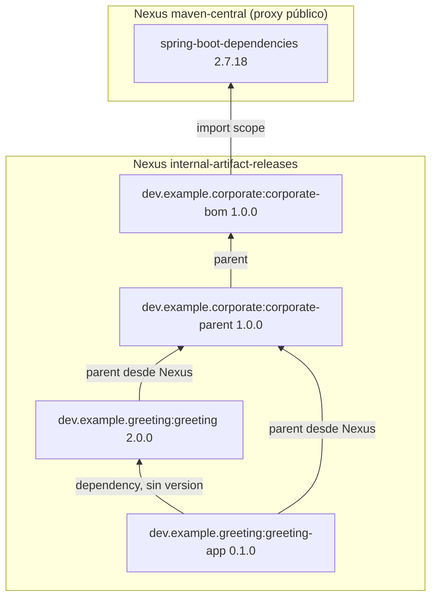
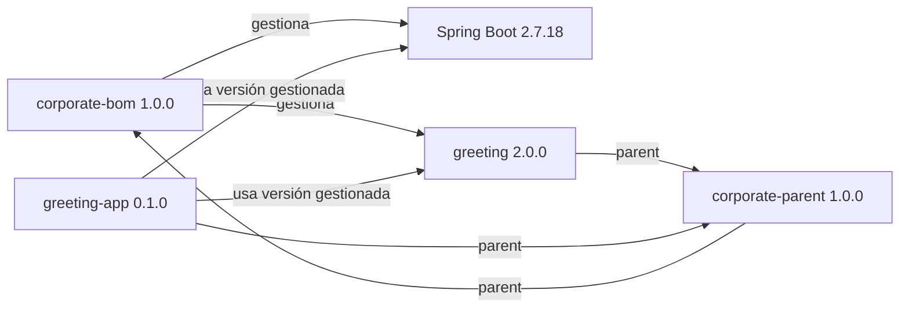
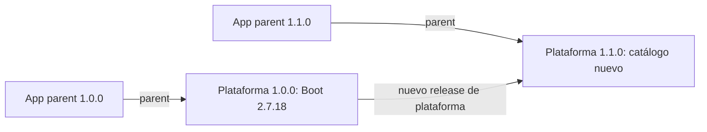
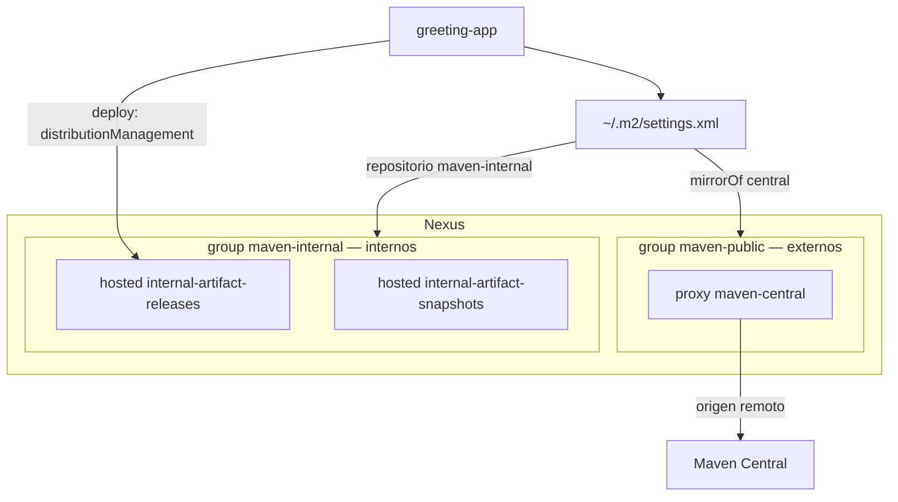

# Parent y BOM corporativos con Spring Boot 2.7

Ejemplo de plataforma Maven de empresa: **Spring Boot 2.7.18** y **Java 8**.
Dos artefactos publicados, con la misma cadena que Spring Boot:

- `corporate-bom` es el catálogo de versiones (`spring-boot-dependencies` en
  Spring Boot). Fija `spring-boot.version`, importa `spring-boot-dependencies`
  y gestiona las librerías internas aprobadas (`greeting` 2.0.0).
- `corporate-parent` es la política de build sobre ese catálogo
  (`spring-boot-starter-parent` en Spring Boot): Java 8, UTF-8, enforcer y
  versiones de plugins.

Cadena de **parent**:

`greeting-app` / `greeting` → `corporate-parent` → `corporate-bom`

aplicación → `spring-boot-starter-parent` → `spring-boot-dependencies`

El BOM es el padre del parent, no un import. Así el parent hereda sus
properties: `spring-boot-maven-plugin` se versiona con `${spring-boot.version}`
y la línea de Boot se cambia en un solo sitio. Un import solo aporta
`dependencyManagement`. Quien quiera el catálogo sin la política de build
puede importar `corporate-bom` sin heredar nada.

Este git tiene **tres proyectos Maven**:

1. `corporate`: reactor de la plataforma (`corporate-bom` + `corporate-parent`)
2. `greeting`
3. `greeting-app`

## Plataforma: una versión, una publicación

`corporate/pom.xml` solo agrega. Ningún POM lo declara como parent y no se
publica (`maven.deploy.skip`).

La versión de plataforma está en un solo sitio, `corporate/.mvn/maven.config`:

```text
-Drevision=1.0.0
-DdeployAtEnd=true
```

El BOM y el parent declaran `${revision}`. `flatten-maven-plugin`
(`resolveCiFriendliesOnly`) escribe `1.0.0` en el POM que se publica. Flatten
solo corre en la plataforma (`inherited` `false`): los productos no lo
heredan.

`mvn -f corporate/pom.xml deploy` construye el BOM y después el parent.
`deployAtEnd` retrasa la subida hasta que ha pasado todo el reactor: si falla
el parent, no queda un BOM suelto en Nexus. No es una transacción; un corte a
mitad de la subida puede dejar solo uno.

`corporate-parent` lee el BOM del checkout
(`<relativePath>../corporate-bom/pom.xml</relativePath>`), porque los dos
salen en el mismo build. `greeting` y `greeting-app` dejan `<relativePath/>`
vacío: Maven pide el parent a Nexus, no a este checkout. Declaran a mano la
versión de `corporate-parent`.

## Settings de usuario: dónde se leen los artefactos

El `settings.xml` de cada desarrollador separa **externos** e **internos**.
No hay un group que mezcle ambos.

- **Externos:** `mirrorOf` de `central` hacia el group `maven-public`
  (Compose, puerto 8081). Ese group solo tiene el proxy `maven-central`.
  Lo que Maven pediría a Maven Central va ahí.
- **Internos:** un profile activo con el group `maven-internal` (los dos
  hosted de empresa). El parent con `<relativePath/>` vacío y las
  librerías `dev.example.*` salen de esa URL, no de `maven-public`.

El deploy **no** usa ningún group: usa las URL de `<distributionManagement>`
(hosted `internal-artifact-releases`). Un group de Nexus no admite
`mvn deploy`.

El password no va escrito en git: en el settings está `${env.NEXUS_PASSWORD}`.
El usuario del `<server>` es `admin` (fijo en el fichero de la demo).

## Corporate-bom: metadatos y dónde se publica (`distributionManagement`)

`<distributionManagement>` y `organization` se declaran una vez, en
`corporate-bom`. Los heredan `corporate-parent`, `greeting` y `greeting-app`:
todos publican en el mismo Nexus y son de la misma organización.

La plataforma **no** declara `<licenses>` ni `<scm>`. Maven no permite cortar
la herencia. Cada producto diría que tiene la licencia de la plataforma y que
vive en su repositorio (con el `artifactId` añadido a la URL). Cada proyecto
declara los suyos si los necesita.

El `<id>` (`nexus-internal-releases`) coincide con un `<server>` del
settings (usuario `admin`, password interpolado). Las URL son
`${env.NEXUS_INTERNAL_RELEASES_URL}` y la de snapshots; Maven las interpola
al hacer deploy. El POM que queda en Nexus lleva ya la URL concreta, no la
variable.

## Demostración

Codespace, reconstruir el contenedor (Maven 3.9.9 y Docker-in-Docker) y:

```bash
./demo.sh
```

El settings de usuario por defecto es `~/.m2/settings.xml`.
El repo guarda `settings/nexus-settings.xml`. `./demo.sh` lo copia ahí para que
`mvn` pueda usar Nexus para consumir artefactos.

Después arranca Nexus y hace deploy del reactor `corporate` (publica
`corporate-bom` y `corporate-parent`) y luego de `greeting`. Antes de cada
producto borra `~/.m2/repository/dev/example` para que la plataforma no salga
del disco. Luego los tests de `greeting-app` (parent, BOM y librería por
`maven-internal`; Spring Boot por `maven-public` → proxy `maven-central`).
Al final, deploy de `greeting-app` con `-DskipTests`.

`greeting` y `greeting-app` declaran `groupId` `dev.example.greeting`. Si no,
heredarían `dev.example.corporate` del parent.

## Estructura elegida



## Versionado

Versión de plataforma, versiones gestionadas y versión de producto son
independientes.



- **Plataforma:** `revision` en `corporate/.mvn/maven.config`. BOM y parent
  salen juntos con esa versión. La aplicación elige plataforma cambiando la
  versión de `corporate-parent`.
- **Gestionadas:** el BOM fija Spring Boot y librerías internas aprobadas. No
  tienen que coincidir con la versión de plataforma.
- **Producto:** cada librería y aplicación declara su versión. Si no, heredaría
  la de la plataforma y se publicaría como si fuera la plataforma.

Cambiar la línea de Spring Boot exige un release nuevo de plataforma. Las
apps ya publicadas no se actualizan solas:



## Repositorios

Nexus OSS trae de serie el group `maven-public` (con hosted vacíos de
ejemplo más el proxy `maven-central`). Esta demo deja `maven-public` **solo**
con `maven-central`: es el group de **externos**. Añade dos hosted de
empresa y el group `maven-internal` con esos miembros, en este orden:
`internal-artifact-releases`, `internal-artifact-snapshots`. Eso es el
group de **internos**.

Los groups son URL de lectura. El proxy `maven-central` es quien habla con
Maven Central en internet. El deploy escribe en el hosted
(`distributionManagement`), no en `maven-internal`.



## Fuentes

- [Spring Boot Maven plugin: using Boot without its parent](https://docs.spring.io/spring-boot/docs/2.7.18/maven-plugin/reference/htmlsingle/#using-boot)
- [Maven settings reference](https://maven.apache.org/settings.html)
- [Maven mirror guide](https://maven.apache.org/guides/mini/guide-mirror-settings)
- [Sonatype: why repositories in POMs are problematic](https://www.sonatype.com/blog/2009/02/why-putting-repositories-in-your-poms-is-a-bad-idea)
- [Nexus Repository REST: repositories](https://help.sonatype.com/en/repositories-api.html)
- [Maven CI-friendly versions](https://maven.apache.org/maven-ci-friendly.html)
- [JLBP-15: publish a BOM for multi-module projects](http://jlbp.dev/JLBP-15)
